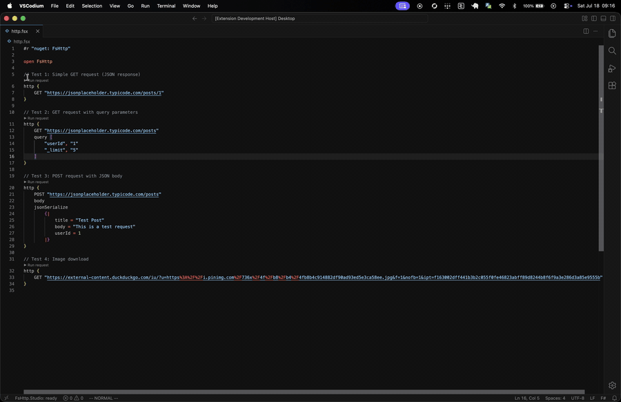

<p align="center">
  
</p>

# FsHttp.Studio

<p align="center">
  <a href="https://marketplace.visualstudio.com/items?itemName=twopoint.fshttp-studio"></a>
  <a href="https://github.com/tw0po1nt/FsHttp.Studio/actions/workflows/ci.yml"></a>
  <a href="./LICENSE"></a>
</p>

A VSCode extension that runs a single [FsHttp](https://github.com/fsprojects/FsHttp) request from your F# script and **renders** the response (images, JSON, HTML) instead of flattening it to text.

## Why

[FsHttp](https://github.com/fsprojects/FsHttp) is a code-first replacement for Postman and `.http` files, and it uses FSI as the driver. But FSI can only **print**. It flattens every response into a string:

- an image becomes a byte dump,
- a JSON payload becomes one dense line you cannot browse,
- an HTML page becomes escaped source.

The part that makes a request tool worth using — *seeing* the response — is the exact part FSI cannot do. FSI's printer also destroys the response body, because that body is read-once by default. Reading the bytes yourself is therefore a trap.

FsHttp.Studio closes that gap. The request stays pure F#, and the editor renders the response richly.

## What it does

Open a `.fsx` script that contains FsHttp requests. A **`▶ Run request` CodeLens** appears above each `http { }` block. Click the CodeLens, and:

- Only *that* block runs. FsHttp.Studio blanks every other block, and then evaluates your script from the top down to the end of that block. It stops there. Nothing after the block runs. This reaches top-level, named, nested, and module-qualified blocks alike. A handful of shapes still can't be reached — a block inside a loop, for instance — and those show a `⊘ Cannot run: …` lens instead of failing silently.
- A **response viewer** panel opens beside your editor. The panel renders the body, and dispatches on the body's `Content-Type`:
  - **images** display inline,
  - **JSON** displays as a collapsible, syntax-highlighted tree,
  - **HTML** displays as a rendered page,
  - all other content displays as readable, wrapped text.
- A thin status line shows the method, the URL, a color-coded status code, the round-trip time, and the size. A collapsible **Request** section shows the method, URL, headers, and body exactly as sent — not just as written, since FsHttp's transformers can rewrite any of them. Response headers stay one click away in their own collapsible section.
- Each of those three sections — Request, response headers, response body — has a **Copy** button, so you can paste any of them elsewhere without hand-selecting text out of a panel.

FsHttp.Studio honors your `#r "nuget: FsHttp, x.y.z"` version pin exactly.

<p align="center">
  
</p>

## Install

**Prerequisite:** a .NET 10 SDK or newer on your `PATH`. Download the SDK from [aka.ms/dotnet/download](https://aka.ms/dotnet/download).

- **VS Code Marketplace.** Use one of these:
  - Install the extension from the [Marketplace listing](https://marketplace.visualstudio.com/items?itemName=twopoint.fshttp-studio).
  - Search for *FsHttp.Studio* in the Extensions view (`Ctrl`/`Cmd`+`Shift`+`X`).
  - Run `ext install twopoint.fshttp-studio` from Quick Open.
- **Open VSX** (VSCodium, Cursor, and other editors outside the Marketplace): coming soon.
- **Direct download (`.vsix`).** Download the latest `fshttp-studio-<version>.vsix` from the [Releases page](https://github.com/tw0po1nt/FsHttp.Studio/releases). Then install it with *Extensions: Install from VSIX…* in the Command Palette, or run `code --install-extension fshttp-studio-<version>.vsix`.

### Verify your download

Each release also ships a `fshttp-studio-<version>.vsix.sha256` checksum file next to the `.vsix`. If *Install from VSIX…* fails with an extraction error such as `too many bytes in the stream`, the download is corrupt. A corporate proxy or an antivirus tool that rewrites binary downloads is the usual cause. Verify the file before you install it. The check either confirms the match or reports a bad download.

Download both files into the same folder, then:

**Linux**

```bash
sha256sum -c fshttp-studio-<version>.vsix.sha256
```

**macOS**

```bash
shasum -a 256 -c fshttp-studio-<version>.vsix.sha256
```

**Windows** (PowerShell). Compare the computed hash with the checksum file:

```powershell
$expected = (Get-Content fshttp-studio-<version>.vsix.sha256).Split(' ')[0]
$actual   = (Get-FileHash fshttp-studio-<version>.vsix -Algorithm SHA256).Hash
if ($actual -ieq $expected) { "OK" } else { "MISMATCH — download is corrupt" }
```

A mismatch means the bytes changed before they reached your machine. Download the file again, and verify it again before you install it. A different transport often avoids the tool that corrupted the first download. For example, use `curl -L`, `Invoke-WebRequest`, or the `gh` CLI.

## Try it

Create a `demo.fsx` file. Paste the code below into it. Then click the **`▶ Run request`** CodeLens above any block.

Each block uses a different `Content-Type`, mostly through the [PokéAPI](https://pokeapi.co/), so you can see every renderer:

```fsharp
#r "nuget: FsHttp"

open FsHttp

// JSON → a collapsible, syntax-highlighted tree
http {
    GET "https://pokeapi.co/api/v2/pokemon/ditto"
}

// HTML → rendered as a page. Browser default styling only, because the
// sandbox blocks the page's own CSS and JS.
http {
    GET "https://example.com"
}

// Image → Pikachu's sprite, displayed inline
http {
    GET "https://raw.githubusercontent.com/PokeAPI/sprites/master/sprites/pokemon/25.png"
}

// Binary → Pikachu's cry (audio/ogg). Shows a "Binary response — <size>" note
// with a hex preview, instead of the broken byte dump FSI prints.
http {
    GET "https://raw.githubusercontent.com/PokeAPI/cries/main/cries/pokemon/latest/25.ogg"
}
```

## How it works

Two processes, one protocol:

- The **extension host**, written in F#, compiled with Fable, owns the CodeLens, the response viewer, and the shell-agnostic **renderer core** (`Content-Type → DOM`).
- The **companion**, a long-lived .NET process that hosts an FSharp.Compiler.Service interactive session, owns all F# parsing and evaluation. It locates blocks, evaluates the block you clicked, and extracts the response.
- The two sides exchange tagged **envelopes** across the companion's process boundary. That boundary is editor-agnostic, so a different editor must reimplement only the extension host. If enough people want it, FsHttp.Studio can support editors that are not based on VSCode.

The companion extracts the response by *reflection* instead of a direct reference to FsHttp, so it never overrides the user's version pin. The extension wires the whole chain end-to-end: block → structured response → rendered image.

The companion runs on the **.NET 10 SDK or newer**. FsHttp.Studio detects `dotnet` on your `PATH` automatically. If your SDK is in another location, set the `fshttpStudio.dotnetPath` setting to your `dotnet` executable.

A Run is bounded by `fshttpStudio.requestTimeoutMs` (30 seconds by default), which covers the connection, the request, and the response download. A stall past that bound fails loudly instead of hanging. Set it to `0` to wait as long as `HttpClient` allows.

[`docs/adr/`](./docs/adr/) records the architectural decisions and their trade-offs. [`CONTEXT.md`](./CONTEXT.md) holds the domain vocabulary.

## Future improvements

- The **request tree**: grouping, naming, and a Testing-API-style tree of your requests.
- A **session model**: reusing an FSI session across Runs, request chaining for a block that needs the *response* of an earlier request (such as an auth token), and sending a block to a specific existing session.
- **Cancel** a Run in progress.
- **Save a response to a file**, for a large or binary body.
- **Copy as curl**, building on the request-as-sent view.
- A **first-run walkthrough**.
- A **copy button on the error render**.
- **`.fs`-in-a-project** execution. FsHttp.Studio supports `.fsx` only. Blocks in compiled `.fs` files show no Run affordance, by design.
- The **inline-card** presentation, which renders under the block instead of in a panel.
- Support for other editors.

Feature requests welcome!

## Built with

F# · [Fable](https://fable.io/) · the VSCode extension API · [FsHttp](https://github.com/fsprojects/FsHttp) · [FSharp.Compiler.Service](https://fsharp.github.io/fsharp-compiler-docs/)

## License

Licensed under the [MIT License](./LICENSE).

The published extension bundles a small set of MIT-licensed components: FSharp.Core, FSharp.Compiler.Service, and Fable's `fable-library`. [`THIRD-PARTY-NOTICES.md`](./THIRD-PARTY-NOTICES.md) reproduces their notices.
