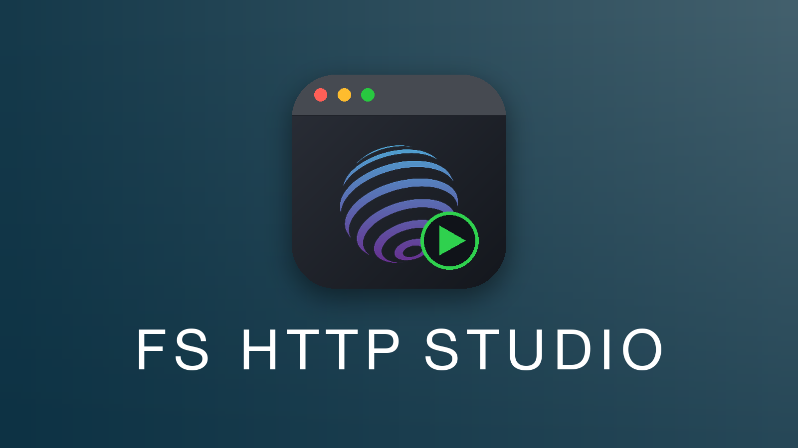

<p align="center">
  
</p>

# FsHttp.Studio

A VSCode extension that runs a single [FsHttp](https://github.com/fsprojects/FsHttp) request straight from your F# script and **renders** the response (images, JSON, HTML) instead of flattening it to text.

## Why

[FsHttp](https://github.com/fsprojects/FsHttp) pitches itself as a code-first replacement for Postman and `.http` files, using FSI as the driver. But FSI can only **print**. It flattens every response into a string: an image comes back as a byte dump, a JSON payload as one dense unbrowsable line, an HTML page as escaped source. The part that makes a request tool worth using, *seeing* the response, is exactly what the FSI workflow can't do. Worse, FSI's printer silently destroys the response body (it's read-once by default), so reaching for the bytes yourself is a trap.

FsHttp.Studio fills that gap: the request stays pure F# and the response gets rendered richly in-editor.

## What it does

Open a `.fsx` script with FsHttp requests in it. A **`▶ Run request` CodeLens** appears above each `http { }` block. Click it, and:

- Only *that* block runs, evaluated against a fresh evaluation of its surrounding **setup** (`open`s, `#r`, helpers), never firing the other requests in the file.
- A **response viewer** panel opens beside your editor and renders the body, dispatched on its `Content-Type`:
  - **images** display inline,
  - **JSON** as a collapsible, syntax-highlighted tree,
  - **HTML** as a rendered page,
  - everything else as readable, wrapped text.
- A thin status line shows method, URL, a color-coded status code, round-trip time and size, with the headers one collapse away.

Your `#r "nuget: FsHttp, x.y.z"` version pin is honored exactly.

## Install

**Prerequisite:** a .NET 10 SDK or newer on your `PATH`. Get it from [aka.ms/dotnet/download](https://aka.ms/dotnet/download).

- **VS Code Marketplace:** search *FsHttp.Studio* in the Extensions view (`Ctrl`/`Cmd`+`Shift`+`X`), or run `ext install twopoint.fshttp-studio` from Quick Open.
- **Open VSX** (VSCodium, Cursor, and other non-Marketplace editors): coming soon.
- **Direct download (`.vsix`):** grab the latest `fshttp-studio-<version>.vsix` from the [Releases page](https://github.com/tw0po1nt/FsHttp.Studio/releases), then install it with *Extensions: Install from VSIX…* (Command Palette) or `code --install-extension fshttp-studio-<version>.vsix`.

### Verifying your download

Each release also ships a `fshttp-studio-<version>.vsix.sha256` checksum next to the `.vsix`. If *Install from VSIX…* fails with an extraction error like `too many bytes in the stream`, your copy was corrupted in transit — often by a corporate proxy or antivirus that rewrites binary downloads. Verify the file before installing; the check should confirm it matches, or tell you the download is bad.

Download both files into the same folder, then:

**Linux**

```bash
sha256sum -c fshttp-studio-<version>.vsix.sha256
```

**macOS**

```bash
shasum -a 256 -c fshttp-studio-<version>.vsix.sha256
```

**Windows** (PowerShell) — compare the computed hash against the checksum file:

```powershell
$expected = (Get-Content fshttp-studio-<version>.vsix.sha256).Split(' ')[0]
$actual   = (Get-FileHash fshttp-studio-<version>.vsix -Algorithm SHA256).Hash
if ($actual -ieq $expected) { "OK" } else { "MISMATCH — download is corrupt" }
```

A mismatch means the bytes changed on the way to your machine — re-download (a different transport, e.g. `curl -L`/`Invoke-WebRequest` or the `gh` CLI, often slips past whatever mangled it) and verify again before installing.

## How it works

Two processes, one protocol:

- The **extension host**, written in F#, compiled with Fable, owns the CodeLens, the response viewer, and the shell-agnostic **renderer core** (`Content-Type → DOM`).
- The **companion**, a long-lived .NET process hosting an FSharp.Compiler.Service interactive session, owns all F# parsing and evaluation. It locates blocks, evaluates the clicked one, and extracts the response.
- They exchange tagged **envelopes** across the companion's process boundary. That boundary is editor-agnostic, meaning that a different editor would need to reimplement only the host. If enough people wanted it, this could be extended to editors beyond ones based on VSCode!

The design deliberately extracts the response by *reflection* rather than referencing FsHttp directly, so the host never overrides the user's version pin. The whole chain (block → structured response → rendered image) is wired end-to-end in the extension.

The companion runs on the **.NET 10 SDK or newer**. FsHttp.Studio auto-detects `dotnet` on your `PATH`; if your SDK lives elsewhere, point the `fshttpStudio.dotnetPath` setting at your `dotnet` executable.

The architectural decisions and their trade-offs are recorded in [`docs/adr/`](./docs/adr/); the domain vocabulary lives in [`CONTEXT.md`](./CONTEXT.md).

## Future improvements 

- the **request tree** (grouping, naming, a Testing-API-style tree of your requests),
- **settings**,
- **`.fs`-in-a-project** execution (v0.1 is `.fsx`-only; blocks in compiled `.fs` files show no Run affordance, by design),
- **request-chaining** (a block that needs a prior request's *response*, e.g. an auth token),
- the **inline-card** presentation (rendering under the block rather than in a panel),
- dedicated **error/timeout/huge-body** rendering.
- Support for other editors

Feature requests welcome!

## Built with

F# · [Fable](https://fable.io/) · the VSCode extension API · [FsHttp](https://github.com/fsprojects/FsHttp) · [FSharp.Compiler.Service](https://fsharp.github.io/fsharp-compiler-docs/)

## License

Licensed under the [MIT License](./LICENSE).

The published extension bundles a small set of MIT-licensed components (FSharp.Core, FSharp.Compiler.Service, and Fable's `fable-library`); their notices are reproduced in [`THIRD-PARTY-NOTICES.md`](./THIRD-PARTY-NOTICES.md).
